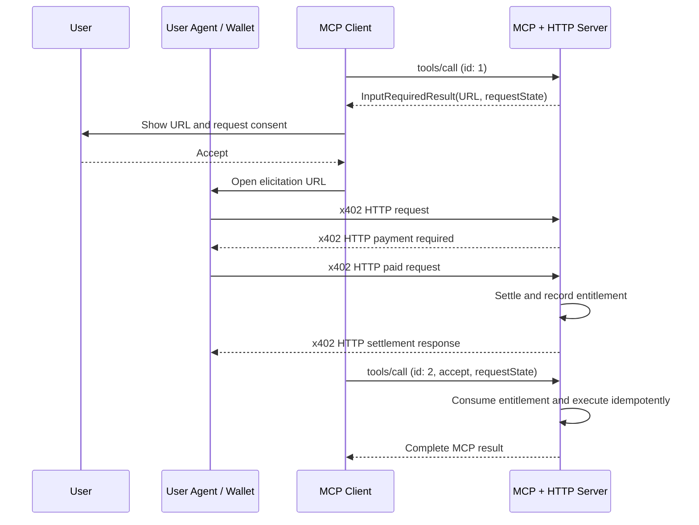

# Transport: MCP (URL Elicitation)

## Summary

This transport composes MCP URL elicitation with the existing x402 HTTP
transport. MCP elicits consent to open a payment URL and resumes the protected
operation after payment; all payment protocol messages use the HTTP transport.

The MCP client never receives or submits `PaymentRequired`, `PaymentPayload`,
or `SettlementResponse` objects. The elicited HTTP resource MUST implement the
[x402 HTTP transport](../transports-v2/http.md) without modification.

This document defines version 3 of the x402 MCP transport. The elicited HTTP
resource continues to use x402 protocol version 2. Transport version and core
x402 protocol version are independent.

## Requirements

This transport requires MCP protocol version `2026-07-28` or later and the MCP
multi round-trip request (MRTR) pattern. It applies to MCP operations that may
return an `InputRequiredResult`:

- `tools/call`
- `resources/read`
- `prompts/get`

Examples use `tools/call`; the same rules apply to the other supported
operations.

The MCP client MUST declare URL elicitation support on every protected request:

```json
{
  "_meta": {
    "io.modelcontextprotocol/protocolVersion": "2026-07-28",
    "io.modelcontextprotocol/clientInfo": {
      "name": "example-client",
      "version": "1.0.0"
    },
    "io.modelcontextprotocol/clientCapabilities": {
      "elicitation": {
        "url": {}
      }
    }
  }
}
```

No x402-specific MCP capability is required. The MCP client implements URL
elicitation and MRTR; the user agent opened at the elicited URL implements the
x402 HTTP exchange. Servers MUST NOT use this transport when the client has not
declared URL elicitation support.

## Payment Flow

1. The client sends a protected MCP request.
2. The server creates a single-use payment request bound to the authenticated
   MCP principal and the exact protected operation.
3. The server returns an `InputRequiredResult` containing a URL mode
   `elicitation/create` request and opaque `requestState`.
4. The client displays the full URL and obtains explicit user consent before
   opening it in a secure user agent.
5. The HTTP resource authenticates the browser user and verifies that it is the
   same principal that initiated the MCP request.
6. The user agent completes payment using the
   [x402 HTTP transport](../transports-v2/http.md).
7. After successful settlement, the server records a single-use entitlement to
   resume the protected MCP operation.
8. The client retries the original MCP request with the elicitation response
   and exact `requestState`.
9. The server atomically consumes the entitlement, executes the operation
   idempotently, and returns the normal terminal MCP result.



The browser interaction and MCP retry may happen concurrently. If the retry
arrives before settlement, the server MAY wait within the request deadline or
return another `InputRequiredResult` indicating that payment is still pending.

## Payment Required Signaling

The MCP server MUST signal payment required with `InputRequiredResult`; it MUST
NOT represent payment required as `isError: true`.

The result MUST contain:

- `resultType: "input_required"`
- one URL mode `elicitation/create` request
- an HTTPS payment URL outside local development
- a human-readable message describing the protected operation and expected
  price
- opaque, integrity-protected `requestState`

```json
{
  "jsonrpc": "2.0",
  "id": 1,
  "result": {
    "resultType": "input_required",
    "inputRequests": {
      "x402_payment": {
        "method": "elicitation/create",
        "params": {
          "mode": "url",
          "url": "https://payments.example.com/x402/requests/req_7Jf3K9",
          "message": "Pay 0.01 USDC on Base to run Advanced financial analysis."
        }
      }
    },
    "requestState": "opaque-integrity-protected-state"
  }
}
```

The message is informative. The `PaymentRequired` advertised by the HTTP
resource is authoritative.

MCP messages in this transport MUST NOT contain `PaymentRequired`,
`PaymentPayload`, or `SettlementResponse` objects in `content`,
`structuredContent`, `_meta`, `inputResponses`, `requestState`, or the
elicitation URL.

## Elicited HTTP Resource

The elicitation URL identifies an HTTP resource whose successful purchase
grants a single-use entitlement to complete the original MCP operation. The
resource MUST follow the x402 HTTP transport for:

- [payment-required signaling](../transports-v2/http.md#payment-required-signaling)
- [payment payload transmission](../transports-v2/http.md#payment-payload-transmission)
- [settlement response delivery](../transports-v2/http.md#settlement-response-delivery)
- [HTTP error handling](../transports-v2/http.md#error-handling)

This specification defines no alternative x402 encodings, headers, or HTTP
status mappings.

The HTTP resource MUST recover the authoritative payment requirements and the
protected operation from server-side state. Its `PaymentRequired.resource.url`
MUST identify the elicitation URL, and its description SHOULD identify the MCP
operation being purchased.

On successful settlement, the server MUST durably associate the HTTP payment
request with:

- a single-use entitlement for the protected MCP operation
- the authenticated MCP principal
- a stable idempotency key
- the terminal HTTP settlement outcome

The HTTP response body is an implementation concern under the HTTP transport.
It SHOULD tell an interactive user whether payment completed and how to return
to the MCP client. It MUST NOT contain the protected MCP result.

## MCP Retry

After consenting to open the URL, the client retries the original request. It
MUST use a new JSON-RPC `id`, preserve the operation parameters, echo the exact
`requestState`, and include the URL elicitation response:

```json
{
  "jsonrpc": "2.0",
  "id": 2,
  "method": "tools/call",
  "params": {
    "name": "financial_analysis",
    "arguments": {
      "ticker": "AAPL",
      "analysis_type": "deep"
    },
    "inputResponses": {
      "x402_payment": {
        "action": "accept"
      }
    },
    "requestState": "opaque-integrity-protected-state",
    "_meta": {
      "io.modelcontextprotocol/protocolVersion": "2026-07-28",
      "io.modelcontextprotocol/clientInfo": {
        "name": "example-client",
        "version": "1.0.0"
      },
      "io.modelcontextprotocol/clientCapabilities": {
        "elicitation": {
          "url": {}
        }
      }
    }
  }
}
```

`action: "accept"` records consent to open the URL; it does not prove payment.
The server MUST consult its authoritative HTTP settlement state before
executing the protected operation.

Clients SHOULD provide explicit retry, resume, and cancel controls and MUST NOT
busy-loop while payment is pending.

If the user declines or cancels before payment, the client MUST retry with the
corresponding action. The server MUST NOT execute the protected operation and
SHOULD invalidate the unpaid payment request. A cancellation received after
settlement cannot undo payment; the server MUST apply its disclosed refund or
compensation policy.

## Completion

After confirming successful settlement, the server MUST atomically consume the
entitlement and execute the protected operation under its stable idempotency
key. It returns the ordinary terminal MCP result with `resultType: "complete"`:

```json
{
  "jsonrpc": "2.0",
  "id": 2,
  "result": {
    "resultType": "complete",
    "content": [
      {
        "type": "text",
        "text": "Financial analysis for AAPL: Strong fundamentals with positive outlook."
      }
    ],
    "isError": false
  }
}
```

Payment settlement is reported on the HTTP leg as defined by the HTTP
transport; it is not repeated in MCP metadata.

If the protected operation fails after settlement, the server MUST return a
stable terminal MCP error and MUST NOT execute or charge again on retry. Refund
and compensation policy is scheme- and application-specific and MUST be
disclosed by the HTTP resource.

## Request State and Idempotency

Servers SHOULD make `requestState` self-contained and integrity protected when
practical. Whether stored or encoded, it MUST be bound to:

- the authenticated MCP principal
- the MCP method and a digest of the operation name, URI, and arguments
- the HTTP payment request identifier
- a digest of the authoritative `PaymentRequired`
- a short expiration time

Clients MUST echo `requestState` exactly and MUST NOT inspect, parse, or modify
it.

The HTTP payment request and MCP state MUST resolve to the same protected
operation and principal. Payment and execution MUST each be single-use and
idempotent. Browser retries, MCP retries, network timeouts, and process restarts
MUST NOT settle payment or execute the operation more than once.

If settlement has an ambiguous outcome, the server MUST reconcile it using the
stable idempotency key before retrying settlement or granting an entitlement.
The server MUST retain the terminal MCP result or use operation-level
idempotency so later retries return the same outcome without repeating side
effects.

## Security Considerations

### URL Safety

The elicitation URL:

1. MUST use HTTPS outside local development.
2. MUST NOT contain payment credentials, access tokens, personal information,
   or other sensitive user information.
3. MUST NOT be pre-authenticated or grant authority by possession alone.
4. MAY contain an opaque request identifier that conveys no authority by
   itself.

MCP clients MUST show the full URL, obtain explicit consent before opening it,
must not prefetch it, and must open it so the client and model cannot inspect
the page or user input, as required by MCP URL elicitation.

### Identity Binding

Before presenting payment requirements or accepting payment, the HTTP resource
MUST authenticate the browser user and verify that the browser principal is the
same principal that initiated the MCP request. It MUST NOT trust identity data
in the URL or unverified identity data supplied by the MCP client.

The URL SHOULD first land on the MCP server or its trusted payment origin. If
the browser has no authenticated session, the resource MAY redirect to
authentication before starting the x402 HTTP exchange. Redirects to wallets or
third-party providers MUST preserve integrity-protected correlation and return
to a server-controlled callback.

### Credential Boundary

All x402 payment protocol messages remain on the HTTP leg. They MUST NOT be
copied into MCP messages, logs, traces, analytics, or error reports.

### Replay and Result Isolation

The server MUST reject:

- browser or MCP state for another authenticated principal
- state for a different MCP method, operation, URI, or arguments
- expired or integrity-invalid state
- payment payloads that do not satisfy the authoritative requirements
- payment requests, authorizations, or entitlements that have already been
  consumed

The protected MCP result MUST be retrievable only through the authenticated MCP
channel. Possession of the elicitation URL or HTTP settlement response MUST NOT
grant access to it.

## Error Handling

Payment errors on the elicited resource follow the
[HTTP transport error rules](../transports-v2/http.md#error-handling). MCP-side
conditions behave as follows:

| Condition                                   | MCP response                    | Required behavior                                                      |
| ------------------------------------------- | ------------------------------- | ---------------------------------------------------------------------- |
| Payment required                            | `InputRequiredResult`           | Return URL elicitation and opaque state.                               |
| User declined or cancelled before payment   | Terminal MCP operation error    | Do not execute the operation; invalidate the unpaid request.           |
| Payment pending                             | `InputRequiredResult`           | Preserve protected state; do not busy-loop.                            |
| Malformed state or elicitation response     | JSON-RPC invalid-params error   | Reject the MCP retry.                                                  |
| Payment failed                              | Terminal MCP operation error    | Do not expose protected content.                                       |
| Protected operation failed after settlement | Stable terminal operation error | Apply disclosed compensation policy and never execute or charge twice. |

For `tools/call`, a terminal operation error is a `CallToolResult` with
`resultType: "complete"` and `isError: true`.

## Compatibility

This transport is not wire-compatible with MCP protocol versions earlier than
`2026-07-28`, which do not support MRTR URL elicitation. Servers MAY fall back
to the [MCP v2 transport](../transports-v2/mcp.md) for older clients.

The elicited resource uses the x402 HTTP v2 transport without modification, so
existing HTTP clients, paywalls, facilitators, and payment middleware can be
reused.

## References

- [Core x402 Specification v2](../x402-specification-v2.md)
- [x402 HTTP Transport v2](../transports-v2/http.md)
- [MCP Elicitation](https://modelcontextprotocol.io/specification/2026-07-28/client/elicitation)
- [MCP Multi Round-Trip Requests](https://modelcontextprotocol.io/specification/2026-07-28/basic/patterns/mrtr)
