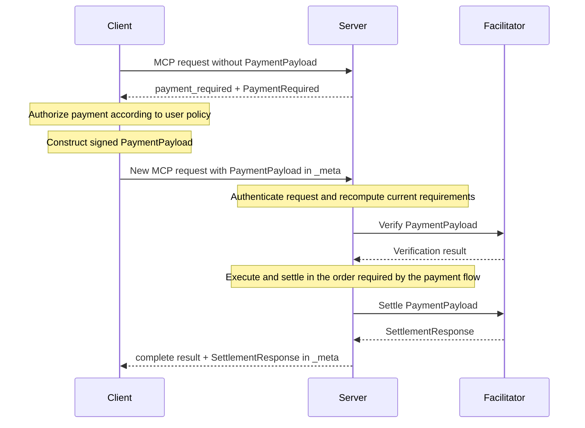

# Transport: MCP v3 (`org.x402/payment` Extension)

## Status

This document proposes an experimental x402 payment extension for the Model Context Protocol (MCP). It is not an official MCP extension.

The key words **MUST**, **MUST NOT**, **REQUIRED**, **SHALL**, **SHALL NOT**, **SHOULD**, **SHOULD NOT**, **RECOMMENDED**, **NOT RECOMMENDED**, **MAY**, and **OPTIONAL** in this document are to be interpreted as described in BCP 14 when, and only when, they appear in all capitals.

## Summary

The `org.x402/payment` extension maps the x402 request-response payment flow onto MCP without creating a server-side continuation.

An unpaid MCP request may return a `payment_required` result containing the x402 `PaymentRequired` object. After authorizing payment, the client sends a new, independent request and carries the x402 `PaymentPayload` in namespaced MCP `_meta`. A successful response carries the x402 `SettlementResponse` in the same namespace.

This design has the same stateless boundary as the [x402 HTTP transport](../transports-v2/http.md): the payment-required response describes acceptable payment, while the subsequent request contains everything needed to verify and process that payment. The server does not need to retain or correlate the first request.

## Requirements

Implementations of this transport require:

- MCP protocol version `2026-07-28` or later, including extension negotiation and extensible result types
- x402 protocol version 2 and its `PaymentRequired`, `PaymentPayload`, and `SettlementResponse` types
- Support for the `org.x402/payment` extension on both the MCP client and server

The MCP transport version is independent of the x402 protocol version. This document is transport v3 and carries x402 v2 objects.

## Extension Identifier

The extension identifier is:

```text
org.x402/payment
```

The extension settings object is empty in this version. Future compatible behavior SHOULD be introduced through optional settings in this object. A breaking change requires a new extension identifier.

## Capability Negotiation

### Client Capability

Clients advertise support in the extension map of the per-request MCP client capabilities:

```json
{
  "_meta": {
    "io.modelcontextprotocol/protocolVersion": "2026-07-28",
    "io.modelcontextprotocol/clientCapabilities": {
      "extensions": {
        "org.x402/payment": {}
      }
    },
    "io.modelcontextprotocol/clientInfo": {
      "name": "ExampleClient",
      "version": "1.0.0"
    }
  }
}
```

A client supporting this extension MUST advertise it on every request for which it can process `payment_required`.

### Server Capability

Servers advertise support in the `server/discover` response:

```json
{
  "jsonrpc": "2.0",
  "id": 1,
  "result": {
    "resultType": "complete",
    "supportedVersions": ["2026-07-28"],
    "capabilities": {
      "tools": {},
      "resources": {},
      "prompts": {},
      "extensions": {
        "org.x402/payment": {}
      }
    },
    "_meta": {
      "io.modelcontextprotocol/serverInfo": {
        "name": "ExampleServer",
        "version": "1.0.0"
      }
    }
  }
}
```

A server MUST NOT return the result type defined by this extension unless the request advertises `org.x402/payment`.

## Protocol Mapping

This extension defines one additional MCP result type and two namespaced metadata fields:

| Direction        | MCP location                                                            | x402 type            |
| ---------------- | ----------------------------------------------------------------------- | -------------------- |
| Server to client | `result.paymentRequired` when `result.resultType` is `payment_required` | `PaymentRequired`    |
| Client to server | `params._meta["org.x402/payment"].paymentPayload`                       | `PaymentPayload`     |
| Server to client | `result._meta["org.x402/payment"].settlementResponse`                   | `SettlementResponse` |

In TypeScript-like notation:

```typescript
interface PaymentRequiredResult extends Result {
  resultType: "payment_required";
  paymentRequired: PaymentRequired;
}

interface PaymentPayloadMetadata {
  paymentPayload: PaymentPayload;
}

interface SettlementMetadata {
  settlementResponse: SettlementResponse;
}
```

`payment_required` extends the result union of supported MCP methods. It means that the requested operation did not execute because payment is required. It is not a JSON-RPC error and it is not a completed method-specific result.

The extension applies to:

- `tools/call`
- `resources/read`
- `prompts/get`

Other MCP extensions MAY define its use on additional methods.

## Payment Flow



The two MCP requests are independent. Each JSON-RPC ID identifies only its own request and MUST NOT be used to correlate the two. The second request MUST be processable without retained data from the first response.

## Payment Required Result

When payment is required and no acceptable `PaymentPayload` is present, a supporting server returns `resultType: "payment_required"` with a `PaymentRequired` object:

```json
{
  "jsonrpc": "2.0",
  "id": 2,
  "result": {
    "resultType": "payment_required",
    "paymentRequired": {
      "x402Version": 2,
      "error": "Payment required to call financial_analysis",
      "resource": {
        "url": "mcp://api.example.com/tools/financial_analysis",
        "description": "Advanced financial analysis",
        "mimeType": "application/json"
      },
      "accepts": [
        {
          "scheme": "exact",
          "network": "eip155:8453",
          "amount": "10000",
          "asset": "0x833589fCD6eDb6E08f4c7C32D4f71b54bdA02913",
          "payTo": "0x209693Bc6afc0C5328bA36FaF03C514EF312287C",
          "maxTimeoutSeconds": 60,
          "extra": {
            "name": "USDC",
            "version": "2"
          }
        }
      ],
      "extensions": {}
    }
  }
}
```

The server MUST NOT execute the protected operation before returning this result.

The client MUST treat `PaymentRequired` as untrusted server input. Before authorizing payment, it MUST validate the object and apply its user-approved payment policy, including limits on recipient, asset, network, amount, and resource.

If the user or policy declines payment, the client simply does not issue a paid request. No cancellation message is required.

## Paid Request

After selecting one entry from `PaymentRequired.accepts`, the client constructs a `PaymentPayload` according to the x402 core specification and selected scheme. It sends a new request for the protected operation with the payload at `params._meta["org.x402/payment"].paymentPayload`.

```json
{
  "jsonrpc": "2.0",
  "id": 3,
  "method": "tools/call",
  "params": {
    "name": "financial_analysis",
    "arguments": {
      "ticker": "AAPL",
      "analysis_type": "deep"
    },
    "_meta": {
      "io.modelcontextprotocol/protocolVersion": "2026-07-28",
      "io.modelcontextprotocol/clientCapabilities": {
        "extensions": {
          "org.x402/payment": {}
        }
      },
      "io.modelcontextprotocol/clientInfo": {
        "name": "ExampleClient",
        "version": "1.0.0"
      },
      "org.x402/payment": {
        "paymentPayload": {
          "x402Version": 2,
          "resource": {
            "url": "mcp://api.example.com/tools/financial_analysis",
            "description": "Advanced financial analysis",
            "mimeType": "application/json"
          },
          "accepted": {
            "scheme": "exact",
            "network": "eip155:8453",
            "amount": "10000",
            "asset": "0x833589fCD6eDb6E08f4c7C32D4f71b54bdA02913",
            "payTo": "0x209693Bc6afc0C5328bA36FaF03C514EF312287C",
            "maxTimeoutSeconds": 60,
            "extra": {
              "name": "USDC",
              "version": "2"
            }
          },
          "payload": {
            "signature": "0x2d6a7588d6acca505cbf0d9a4a227e0c52c6c34008c8e8986a1283259764173608a2ce6496642e377d6da8dbbf5836e9bd15092f9ecab05ded3d6293af148b571c",
            "authorization": {
              "from": "0x857b06519E91e3A54538791bDbb0E22373e36b66",
              "to": "0x209693Bc6afc0C5328bA36FaF03C514EF312287C",
              "value": "10000",
              "validAfter": "1740672089",
              "validBefore": "1740672154",
              "nonce": "0xf3746613c2d920b5fdabc0856f2aeb2d4f88ee6037b8cc5d04a71a4462f13480"
            }
          },
          "extensions": {}
        }
      }
    }
  }
}
```

The client SHOULD repeat the intended method and parameters, but the paid request is authoritative. A server MUST price and authorize the operation described by the paid request rather than assuming it matches an earlier request.

The `PaymentPayload` MUST NOT be included in tool arguments, prompt arguments, resource URIs, model-visible content, or logs. The `_meta` location keeps payment protocol data separate from application inputs; it does not make that data secret from the MCP client, server, or transport intermediaries.

## Server Processing

For every paid request, the server MUST:

1. Authenticate and authorize the MCP request independently.
2. Determine the current `PaymentRequired` for the authenticated principal, MCP method, method identifier, and method parameters.
3. Validate the submitted `PaymentPayload` against those current requirements using the x402 core rules, just as a server does for the [HTTP transport](../transports-v2/http.md).
4. Verify, execute, and settle in the order required by the selected payment flow in [Section 6.1 of the x402 core specification](../x402-specification-v2.md).
5. Return protected content only when allowed by that payment flow.

The server MUST NOT trust a client-supplied `resource`, `accepted`, price, or recipient without comparing it to requirements derived for the paid request.

## Successful Response

On successful processing, the server returns the normal completed result for the MCP method and MUST include `SettlementResponse` in namespaced `_meta`:

```json
{
  "jsonrpc": "2.0",
  "id": 3,
  "result": {
    "resultType": "complete",
    "content": [
      {
        "type": "text",
        "text": "Financial analysis for AAPL: Strong fundamentals with positive outlook..."
      }
    ],
    "isError": false,
    "_meta": {
      "org.x402/payment": {
        "settlementResponse": {
          "success": true,
          "transaction": "0x1234567890abcdef1234567890abcdef1234567890abcdef1234567890abcdef",
          "network": "eip155:8453",
          "payer": "0x857b06519E91e3A54538791bDbb0E22373e36b66"
        }
      }
    }
  }
}
```

The method-specific fields in this example are for `tools/call`. A `resources/read` or `prompts/get` response retains its normal completed result shape and uses the same `_meta` location for settlement.

## Statelessness and Quote Binding

The server MUST be able to process the paid request without remembering the unpaid request or payment-required response. In particular:

- No correlation identifier from the first response is required.
- The `PaymentPayload` identifies the selected requirements and supplies the scheme-specific authorization.
- Current authoritative requirements are recomputed from the paid request.
- Authentication and authorization are evaluated again on the paid request.

This does not prohibit the ordinary storage required for payment settlement, replay prevention, application data, or idempotency. It only prohibits making correctness depend on retained continuation data from the unpaid request.

If a server needs to guarantee that a quoted price remains valid across requests, it SHOULD use a cryptographically verifiable x402 [offer](../extensions/extension-offer-and-receipt.md). The signed offer travels in `PaymentRequired.extensions`, is echoed in `PaymentPayload.extensions`, and can be verified without storing the original quote.

## Idempotency and Replay Protection

The initial unpaid request MUST NOT execute the protected operation and is therefore safe to repeat.

Paid requests can be retried because of transport failures. Implementations MUST apply the replay protections of the selected x402 scheme. Servers and facilitators SHOULD support the x402 [`payment-identifier`](../extensions/payment_identifier.md) extension when request deduplication is needed.

For operations with non-idempotent application side effects, the application MUST additionally use an idempotency mechanism appropriate to that operation. Payment deduplication alone does not deduplicate application effects.

## Error Handling

### Missing Payment

If the operation requires payment and the request contains no `PaymentPayload`, the server returns `payment_required` with current requirements.

### Invalid or Expired Payment

If payment verification fails and the client can reasonably retry, the server SHOULD return another `payment_required` result. Its `PaymentRequired.error` SHOULD explain the failure without exposing sensitive implementation details, and its `accepts` MUST contain current acceptable terms.

### Settlement Failure

Settlement failures follow the selected x402 payment flow and the [x402 HTTP transport's settlement semantics](../transports-v2/http.md#settlement-response-delivery). The server MUST NOT return protected content when the payment flow does not permit it. When a `SettlementResponse` is available, the server SHOULD include it in `result._meta["org.x402/payment"].settlementResponse`, including `success: false` and `errorReason` as defined by x402 core.

### Protocol and Application Errors

Malformed MCP requests and failures unrelated to payment use the normal MCP JSON-RPC and method-specific error mechanisms. A server MUST NOT use `payment_required` for errors that payment cannot resolve.

## Security Considerations

### Payment Authorization

A `PaymentPayload` can authorize transfer of value. A client MUST obtain explicit user approval or apply a user-configured payment policy before constructing or sending it. Model output alone MUST NOT authorize payment.

The approval UI or policy engine SHOULD display or constrain, at minimum, the recipient, asset, network, amount, resource, and expiration. Clients SHOULD apply per-payment and aggregate spending limits.

### Wallet Isolation

Private keys, seed phrases, API keys, and other reusable payment credentials MUST NOT be transmitted through MCP. Signing SHOULD occur in an isolated wallet or payment component. Only the bounded `PaymentPayload` is carried by this extension.

If a payment scheme requires a reusable secret or credential in its `PaymentPayload`, that scheme MUST NOT be used with this in-band transport. The client SHOULD instead use a trusted out-of-band payment flow, such as URL elicitation to an endpoint implementing the x402 HTTP transport.

### MCP Elicitation

This extension does not use form or URL elicitation. The payment-required signal is an extension-defined MCP result, and the paid operation is a new client request.

This design does not relax MCP's rules for elicitation or sensitive data. Formal adoption requires MCP review of the in-band, transaction-specific `PaymentPayload` boundary. Until then, implementations MUST treat this document as experimental and require explicit opt-in.

### Identity and Request Integrity

Servers MUST derive user identity from authenticated MCP request credentials rather than client-asserted identity fields. They MUST authenticate both the unpaid and paid requests and MUST bind pricing, verification, execution, and settlement to the paid request's authenticated principal and operation.

Servers and clients MUST redact payment payloads from logs, traces, analytics, crash reports, and transcripts. Diagnostic data SHOULD contain only the minimum identifiers necessary for reconciliation.

## Compatibility and Fallbacks

Clients that do not advertise `org.x402/payment` cannot safely receive the extension's result type. A payment-protected server MUST use one of these alternatives:

- Use URL elicitation to direct the user to an endpoint implementing the [x402 HTTP transport](../transports-v2/http.md).
- Use the [MCP v2 x402 transport](../transports-v2/mcp.md) when both parties intentionally negotiate an older compatible MCP protocol version.
- Reject the request using MCP's `MissingRequiredClientCapability` error.

Clients MUST treat an unrecognized result type as invalid according to MCP. Servers therefore MUST perform capability checks before returning `payment_required`.

## References

- [x402 Protocol Specification v2](../x402-specification-v2.md)
- [x402 HTTP Transport v2](../transports-v2/http.md)
- [x402 MCP Transport v2](../transports-v2/mcp.md)
- [MCP Extensions](https://modelcontextprotocol.io/extensions/overview)
- [MCP 2026-07-28 Base Protocol](https://modelcontextprotocol.io/specification/2026-07-28/basic)
- [MCP 2026-07-28 Elicitation](https://modelcontextprotocol.io/specification/2026-07-28/client/elicitation)
